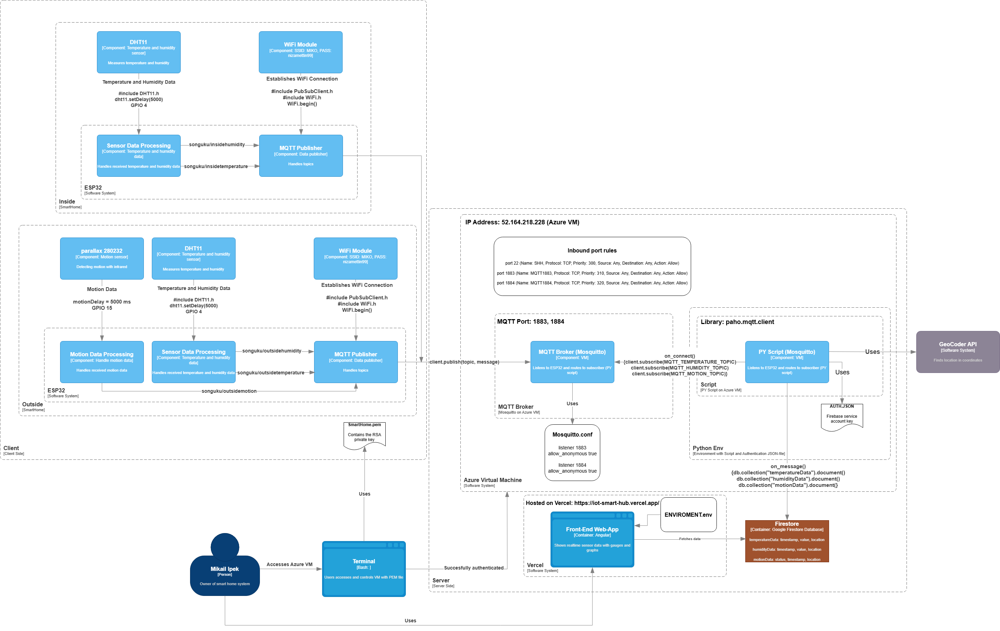

# IoT Smart Home Platform

## Overview

This project is a full-stack IoT Smart Home platform designed to monitor and visualize sensor data from a smart home environment. The system integrates hardware (ESP32 microcontrollers), a backend for data ingestion and storage, and a modern React-based frontend for real-time visualization and user management.

- **Frontend**: React.js (this repository, in the `frontend` folder)
- **Backend**: Node.js/Express (see `backend` folder)
- **Hardware**: ESP32 microcontrollers with various sensors (see `ESP32 code` folder)
- **Documentation**: See `iot_rapport.pdf` for a detailed technical report
- **Architecture Diagram**: 

---

## Features

- **User Authentication**: Secure sign-up, sign-in, and session management (Firebase Auth)
- **Real-Time Sensor Data**: Live updates from temperature, humidity, and motion sensors
- **Dashboard**: Interactive charts and statistics for all connected sensors
- **Customizable Time Ranges**: Analyze sensor data over selectable periods
- **Alert System**: Real-time alerts for abnormal sensor readings
- **Responsive UI**: Modern, mobile-friendly design with light/dark themes
- **Role-Based Access**: Private routes for authenticated users

---

## Project Structure

```
IOT-SmartHome/
├── backend/                # Backend API and data ingestion
├── ESP32 code/             # Microcontroller firmware
├── frontend/               # React frontend (this project)
│   ├── public/
│   └── src/
│       ├── components/     # UI components (dashboard, auth, layout, etc.)
│       ├── constants/      # Shared constants (e.g., sensor types)
│       ├── context/        # React context providers (Auth, Theme)
│       ├── hooks/          # Custom React hooks (e.g., useSensorData)
│       ├── pages/          # Main pages (Dashboard, Graphs, Home, Login)
│       ├── services/       # API and Firebase integration
│       ├── styles/         # CSS (global, themes, components)
│       └── utils/          # Utility functions (session, validation)
├── iot_rapport.pdf         # Full technical report (Danish)
├── C4.png                  # System architecture diagram
└── README.md
```

---

## System Architecture

See the [C4.png](C4.png) image for a high-level overview of the system architecture, including:

- ESP32 devices sending sensor data via WiFi
- Backend API for data ingestion and storage
- Firebase for authentication and real-time database
- React frontend for visualization and user interaction

For a detailed explanation of the architecture, design decisions, and implementation, refer to the [iot_rapport.pdf](iot_rapport.pdf) report.

---

## Getting Started

### Prerequisites

- Node.js (v18+ recommended)
- npm (v9+ recommended)

### Installation

1. Clone the repository:
   ```sh
   git clone <repo-url>
   cd IOT-SmartHome/frontend
   ```
2. Install dependencies:
   ```sh
   npm install
   ```
3. Configure environment variables as needed (see `.env.example` if available).

### Running the App

- Start the development server:
  ```sh
  npm start
  ```
- Open [http://localhost:3000](http://localhost:3000) in your browser.

### Building for Production

- Build the app:
  ```sh
  npm run build
  ```
- The production-ready files will be in the `build/` folder.

---

## Usage

- Register or log in to access the dashboard.
- View real-time and historical sensor data.
- Use the dashboard to analyze trends, receive alerts, and manage your smart home environment.

---

## References

- [iot_rapport.pdf](iot_rapport.pdf): Full technical documentation (Danish)
- [C4.png](C4.png): System architecture diagram
